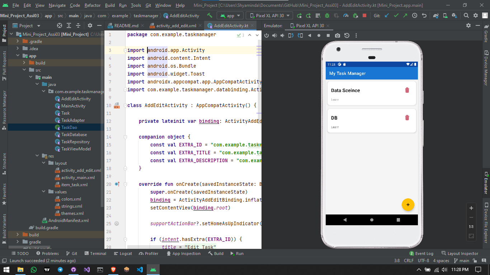

App Description: Task Manager

---Summary----
A simple Android application designed to create and manage personal tasks with a clean user interface and reliable data storage.

----Core Features-----

* Add Tasks: Quick input for task titles and descriptions.

* View List: A scrollable RecyclerView to see all saved notes in one place.

* Data Persistence: Uses a Room Database to save data locally, so tasks remain even after the app is closed.

* Material Design: Clean layout with proper spacing and meaningful labels for a better user experience.

--Technical Stack---
* Language: Kotlin
* Database: Room (SQLite)
* Architecture: MVVM (Model-View-ViewModel) logic.
* Min SDK: Compatible with Android 7.0 and above.

---Screenshots---

using _ _ _ _

* **IDE:** Android Studio Chipmunk (2021.2)
* **Language:** Kotlin
* **JDK Version:** Java 11 (Standard for Chipmunk)
* **Android Gradle Plugin (AGP):** 7.2.1
* **Gradle Wrapper:** 7.4.2
* **BuildToolsVersion** "32.0.0"
* **Architecture:** MVVM (Model-View-ViewModel)
* **Database:** Room Persistence Library

